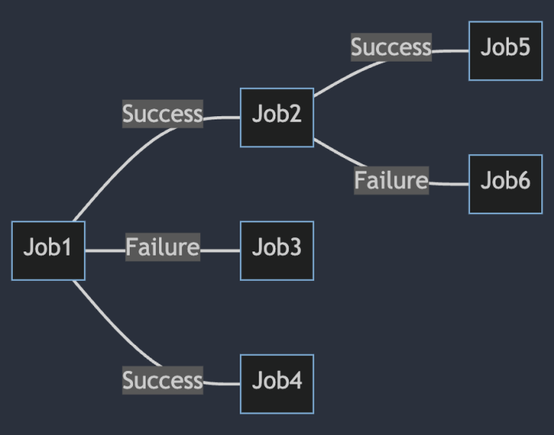

# Model Dependencies
This chapter explains how to define jobs that should automatically run based on the completion of other jobs. This feature is useful when you have a series of tasks that must be executed in a specific order allowing to build a pipeline of jobs.

## Modelling Dependencies with `When`
In **NCronJob**, you can define job dependencies using the `When` method. This method allows you to specify that a job should run only after another job has completed successfully or faulted.

```csharp
Services.AddNCronJob(options => 
{
    options.AddJob<JobB>().When(
        success: s => s.RunJob<SuccessJob>(),
        faulted: f => f.RunJob<FaultedJob>());
});
```

Both `success` and `faulted` are optional so that you can define only one of them if needed. `RunJob` can be chained to allow multiple jobs to run after the completion of the main job.

This allows very complex job dependencies to be defined in a simple and readable way.


### Passing parameters to dependent jobs
The `RunJob` method allows optional parameters to be passed to the dependent job. 

```csharp
Services.AddNCronJob(options => 
{
    options.AddJob<JobB>().When(success: s => s.RunJob<SuccessJob>("Foo"));
});
```

## Accessing the state of the parent job
The `JobExecutionContext` object passed to the dependent job contains the output of the parent job. This allows access to the state of the parent job. This can be helpful if information should flow from parent to the child job.

```csharp
public class JobA : IJob
{
    public Task ExecuteAsync(JobExecutionContext context)
    {
        context.Output = "Hello World";
        return Task.CompletedTask;
    }
}

public class JobB : IJob
{
    public Task ExecuteAsync(JobExecutionContext context)
    {
        var parentOutput = context.ParentOutput; // "Hello World"
        return Task.CompletedTask;
    }
}

// Register the dependency so that JobB runs after JobA automatically
Services.AddNCronJob(options => 
{
    options.AddJob<JobA>().When(success: s => s.RunJob<JobB>());
});
```
