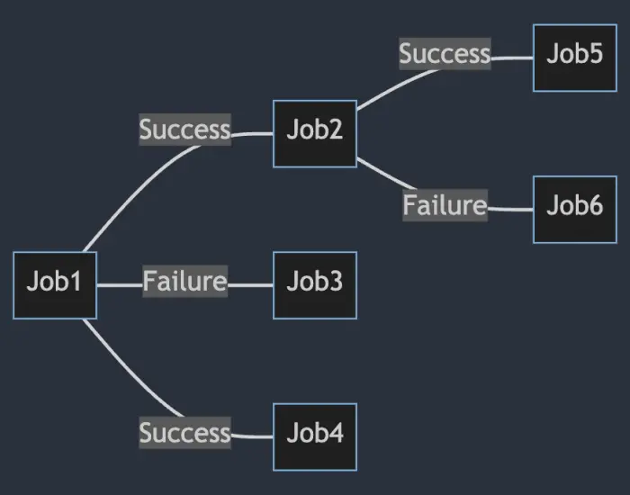

# Model Dependencies
This chapter explains how to define jobs that should automatically run based on the completion of other jobs. This feature is useful when you have a series of tasks that must be executed in a specific order allowing to build a pipeline of jobs.

## Modelling Dependencies with `ExecuteWhen`
In **NCronJob**, you can define job dependencies using the `ExecuteWhen` method. This method allows you to specify that a job should run only after another job has completed successfully or faulted.

```csharp
Services.AddNCronJob(options => 
{
    options.AddJob<JobB>().ExecuteWhen(
        success: s => s.RunJob<SuccessJob>(),
        faulted: f => f.RunJob<FaultedJob>());
});
```

Both `success` and `faulted` are optional so that you can define only one of them if needed. `RunJob` can be chained to allow multiple jobs to run after the completion of the main job.

This allows very complex job dependencies to be defined in a simple and readable way.


### Passing parameters to dependent jobs
The `RunJob` method allows optional parameters to be passed to the dependent job. 

```csharp
Services.AddNCronJob(options => 
{
    options.AddJob<JobB>().ExecuteWhen(success: s => s.RunJob<SuccessJob>("Foo"));
});
```

## Accessing the state of the parent job
The `JobExecutionContext` object passed to the dependent job contains the output of the parent job. This allows access to the state of the parent job. This can be helpful if information should flow from parent to the child job.

```csharp
public class JobA : IJob
{
    public Task ExecuteAsync(IJobExecutionContext context)
    {
        context.Output = "Hello World";
        return Task.CompletedTask;
    }
}

public class JobB : IJob
{
    public Task ExecuteAsync(IJobExecutionContext context)
    {
        var parentOutput = context.ParentOutput; // "Hello World"
        return Task.CompletedTask;
    }
}

// Register the dependency so that JobB runs after JobA automatically
Services.AddNCronJob(options => 
{
    options.AddJob<JobA>().ExecuteWhen(success: s => s.RunJob<JobB>());
});
```

## Order of execution between `INotificationJobHandler` and dependent jobs
If a job has a dependency on another job, the dependent job will run after the `INotificationJobHandler` has been executed and awaited.


## Tracing requests of dependencies via `CorrelationId`
Every `JobExecutionContext` has a `CorrelationId` property that can be used to trace the execution of dependent jobs. This property is automatically set to the `CorrelationId` of the parent job and stays the same for all dependent jobs down the chain.

## Cancelling dependent jobs
To actively cancel dependent jobs, the `JobExecutionContext` object passed offers a `SkipChildren` method. This method can be called to prevent dependent jobs from running.

```csharp
public class JobA : IJob
{
    public Task ExecuteAsync(IJobExecutionContext context)
    {
        context.SkipChildren();
        return Task.CompletedTask;
    }
}

public class JobB : IJob
{
    public Task ExecuteAsync(IJobExecutionContext context)
    {
        // This job will not run
        return Task.CompletedTask;
    }
}

builder.Services.AddNCronJob(options => 
{
    options.AddJob<JobA>().ExecuteWhen(success: s => s.RunJob<JobB>());
});
```

## Minimal API
The `ExecuteWhen` method can also be used in a [Minimal API](minimal-api.md) to define job dependencies:
```csharp
builder.Services.AddNCronJob(options => 
{
    options.AddJob<ImportDataJob>().ExecuteWhen(
        success: s => s.RunJob(async (ITransfomerService transformerService) => await transformerService.TransformDataAsync()),
        faulted: f => f.RunJob(async (INotificationService notificationService) => await notificationService.SendNotificationAsync()));
});
```

### Getting the parent job's output in a Minimal API
If you pass in a `JobExecutionContext` to the dependent job, you can access the parent job's output:

```csharp
builder.Services.AddNCronJob(options => 
{
    options.AddJob<ImportDataJob>().ExecuteWhen(
        success: s => s.RunJob(async (IJobExecutionContext context, ITransfomerService transformerService) => 
        {
            var parentOutput = (MyDataModel)context.ParentOutput;
            await transformerService.TransformDataAsync(parentOutput);
        }));
});
```

### Defining dependencies for minimal Jobs
To define that a job should be executed afterward, you can use the `AddJob` overload like this:

```csharp
builder.Services.AddNCronJob(options => {
    options.AddJob(async (IMyService myService) => await myService.Run())
        .ExecuteWhen(success: b => b.RunJob(() => Console.Write("Run when successful")));
});
```

## Run mutliple jobs after the completion of a job

You can run multiple jobs after the completion of a job:
```no-class
Job A -- successful --> Job B
      |- successful --> Job C
```

Can be achieved in two ways:

```csharp
Services.AddNCronJob(options => 
{
    options.AddJob<JobA>().ExecuteWhen(success: s => s.RunJob<JobB>().RunJob<JobC>());
});
```

Or by chaining the `ExecuteWhen` method:

```csharp
Services.AddNCronJob(options => 
{
    options.AddJob<JobA>()
        .ExecuteWhen(success: s => s.RunJob<JobB>())
        .ExecuteWhen(success: s => s.RunJob<JobC>());
    
    // Register JobB and JobC into the container to avoid warnings
    options.AddJob<JobB>();
    options.AddJob<JobC>();
});
```

!!! note

    The order of execution of the dependent jobs is not guaranteed. They will not necessarily run in the order of registration.
    
    In the example above, it can happen that `JobC` runs before `JobB`.
    If you need to ensure the order of execution, see the next section.

## Construct complex dependencies
You can construct complex dependencies by using a combination of `AddJob` and `ExecuteWhen` methods. Here an example:

```
Job A -> Job B -> Job C
```

This can be achieved by:

```csharp
Services.AddNCronJob(options => 
{
    options.AddJob<JobA>().ExecuteWhen(success: s => s.RunJob<JobB>()
           .AddJob<JobB>().ExecuteWhen(success: s => s.RunJob<JobC>());

    // Register JobC into the container to avoid warnings
    options.AddJob<JobC>();
});
```